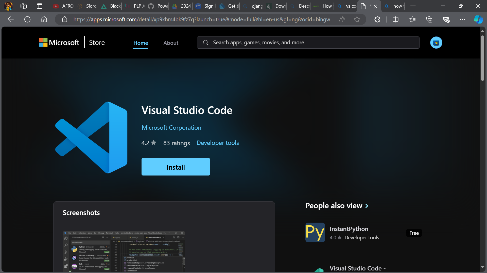
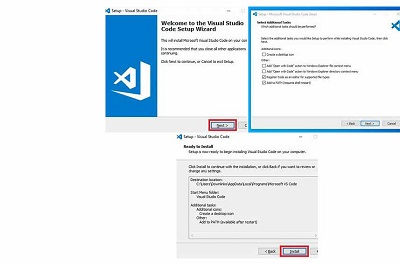
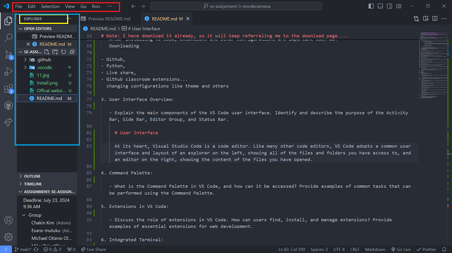
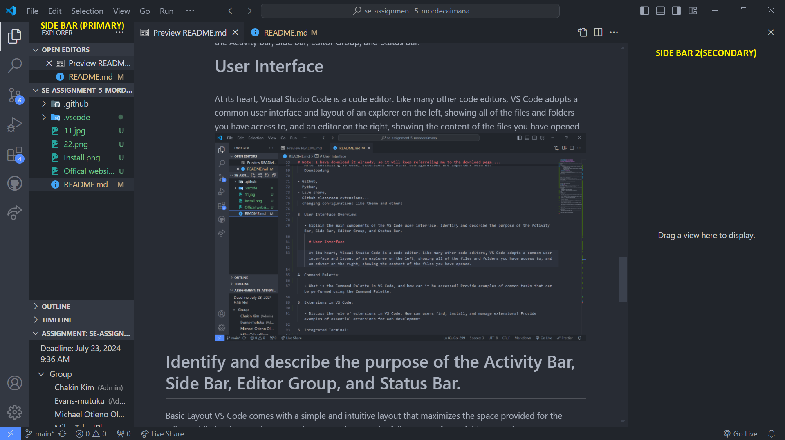

# SE-Assignment-5

Installation and Navigation of Visual Studio Code (VS Code)
Instructions:
Answer the following questions based on your understanding of the installation and navigation of Visual Studio Code (VS Code). Provide detailed explanations and examples where appropriate.

Questions:

1.  Installation of VS Code:

         - Describe the steps to download and install Visual Studio Code on Windows 11 operating system. Include any prerequisites that might be needed.

                # STEPS ON HOW TO INSTALL VS CODE

                Installing Visual Studio Code in Windows 11 is a straightforward process that involves downloading the installer from the official website, running it, and setting up the software on your system.

                # Image of the offical website

     ![alt text]

.jpeg>)
Step 1:- Download the Installer

    First, head over to the official Visual Studio Code website.
    Visit the website and look for the download button. Click on it, and make sure you select the version that’s compatible with Windows 11. The download should start automatically.
    

Step 2: Run the Installer
After the download completes, open the installer file.

# Note: I have download it already, so it will keep referraling me to the download page....

Step 3: Accept the License Agreement
Next, accept the terms and conditions by checking the box and clicking "Next".

You’ll be presented with a license agreement. It’s important to read through this to understand your rights and obligations. Once you agree, proceed to the next step.

Step 4: Choose Installation Location
Select the folder where you want Visual Studio Code to be installed, then click "Next".

By default, it will suggest a directory. If you’re fine with that, just proceed. Otherwise, choose a different location on your machine.

Step 5: Select Additional Tasks

Choose any additional tasks like creating a desktop icon and then click "Next".

These tasks are optional but can make using Visual Studio Code more convenient. For instance, adding it to your PATH allows you to open it from the command line.

Step 6: Install
Click "Install" to begin the installation process.

The installer will now copy all necessary files to your system. This might take a few minutes, so be patient.

Step 7: Launch Visual Studio Code
Once the installation is complete, check the box to launch Visual Studio Code, then click "Finish".

You can also launch it later from the Start Menu or desktop icon if you created one.

After completing these steps, Visual Studio Code will open, and you can start customizing it with extensions and settings to fit your needs.

2. First-time Setup:

   - After installing VS Code, what initial configurations and settings should be adjusted for an optimal coding environment? Mention any important settings or extensions.

   After installing Vs code, extensions and other configurations are important such as:-
   Downloading

- Github,
- Python,
- Live share,
- Github classroom extensions...
  changing configurations like theme and others

3. User Interface Overview:

   - Explain the main components of the VS Code user interface. Identify and describe the purpose of the Activity Bar, Side Bar, Editor Group, and Status Bar.

     # User Interface

     At its heart, Visual Studio Code is a code editor. Like many other code editors, VS Code adopts a common user interface and layout of an explorer on the left, showing all of the files and folders you have access to, and an editor on the right, showing the content of the files you have opened.
     

# Identify and describe the purpose of the Activity Bar, Side Bar, Editor Group, and Status Bar.

Basic Layout
VS Code comes with a simple and intuitive layout that maximizes the space provided for the editor, while leaving ample room to browse and access the full context of your folder or project.

- Activity Bar - Located on the far left-hand side. Lets you switch between views and gives you additional context-specific indicators, like the number of outgoing changes when Git is enabled. You can change the position of the Activity Bar.
- Side Bar - Contains different views like the Explorer to assist you while working on your project.
  there are two types of side bar...
  - Primary Side Bar - Contains different views like the Explorer to assist you while working on your project.
  - A Secondary Side Bar is also available to display views opposite the Primary Side Bar. You can show it with Ctrl+Alt+B and drag a view from the Primary Side Bar to the Secondary Side Bar. 
- Editor Group - The main area to edit your files. You can open as many editors as you like side by side vertically and horizontally.
  Status Bar - Information about the opened project and the files you edit.

4. Command Palette:

   - What is the Command Palette in VS Code, and how can it be accessed? Provide examples of common tasks that can be performed using the Command Palette.

   The Command Palette in Visual Studio Code enables users to swiftly find and apply commands. Accessing the Command Palette can be achieved through View > Command Palette or by using keyboard shortcuts Cmd–Shift–P (Mac) or Ctrl–Shift–P (Windows). The Command Palette can be utilized to transform selected text into title case.
   

5. Extensions in VS Code:

   - Discuss the role of extensions in VS Code. How can users find, install, and manage extensions? Provide examples of essential extensions for web development.

6. Integrated Terminal:

   - Describe how to open and use the integrated terminal in VS Code. What are the advantages of using the integrated terminal compared to an external terminal?

7. File and Folder Management:

   - Explain how to create, open, and manage files and folders in VS Code. How can users navigate between different files and directories efficiently?

8. Settings and Preferences:

   - Where can users find and customize settings in VS Code? Provide examples of how to change the theme, font size, and keybindings.

9. Debugging in VS Code:

   - Outline the steps to set up and start debugging a simple program in VS Code. What are some key debugging features available in VS Code?

10. Using Source Control:
    - How can users integrate Git with VS Code for version control? Describe the process of initializing a repository, making commits, and pushing changes to GitHub.

Submission Guidelines:

- Your answers should be well-structured, concise, and to the point.
- Provide screenshots or step-by-step instructions where applicable.
- Cite any references or sources you use in your answers.
- Submit your completed assignment by 1st July
